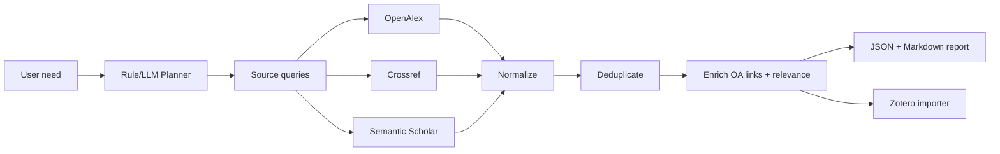

# Architecture

## Goal

The project turns a natural-language research need into a reproducible literature search workflow:

1. Understand the user need.
2. Extract Chinese and English keywords.
3. Build source-specific queries.
4. Search multiple scholarly sources.
5. Normalize paper metadata.
6. Deduplicate and rank.
7. Export reports.
8. Import selected papers into Zotero.

## Current MVP

## Module Boundaries

- `planner.py`: deterministic first-pass need decomposition and query generation.
- `llm_planner.py`: optional OpenAI structured-output planning with rule fallback.
- `search/`: one adapter per academic source.
- `dedupe.py`: DOI-first and title-fallback duplicate merging.
- `enrich.py`: relevance scoring, PDF link cleanup, and open-access link enrichment.
- `report.py`: persistent JSON and Markdown outputs.
- `zotero.py`: Zotero API integration through pyzotero.
- `pipeline.py`: orchestration.

## Source Policy

Use official or API-friendly sources first:

- OpenAlex
- Crossref
- Semantic Scholar
- Web of Science API when credentials are available

Use browser automation only for user-mediated workflows:

- CNKI logged-in export pages
- Google Scholar spot checks
- Zotero Connector-style saves

Avoid features that bypass access controls, CAPTCHA, paywalls, or institutional usage agreements.
